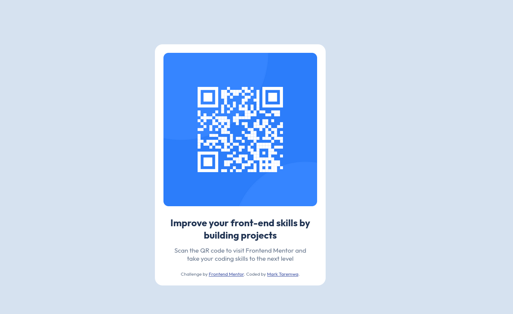

# Frontend Mentor - QR code component solution

## Table of contents

  - [Screenshot](#screenshot)
  - [Links](#links)
  - [Built with](#built-with)
  - [Useful resources](#useful-resources)

### Screenshot

**Note: Delete this note and the paragraphs above when you add your screenshot. If you prefer not to add a screenshot, feel free to remove this entire section.**

### Links

- Solution URL:(https://github.com/taremwa/Frontend-Mentor_projects/tree/main/qr-code-component-main)
- Live Site URL:(https://your-live-site-url.com)

### Built with
Basic Html & CSS

### Useful resources

CSS Transformations (https://nelkodev.com/en/blog/css-transformations-learn-to-use-translate-and-transform-translate/)
--> for a simpler explanation about css tranformations and how to apply them

